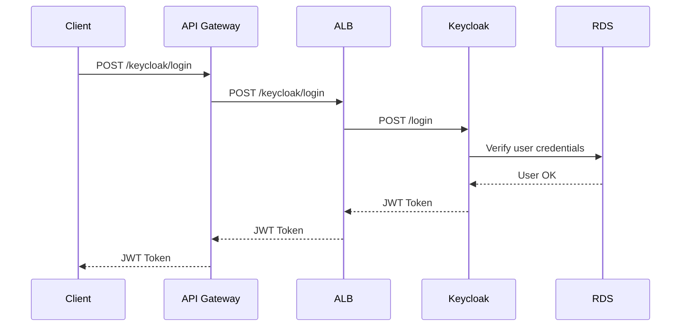
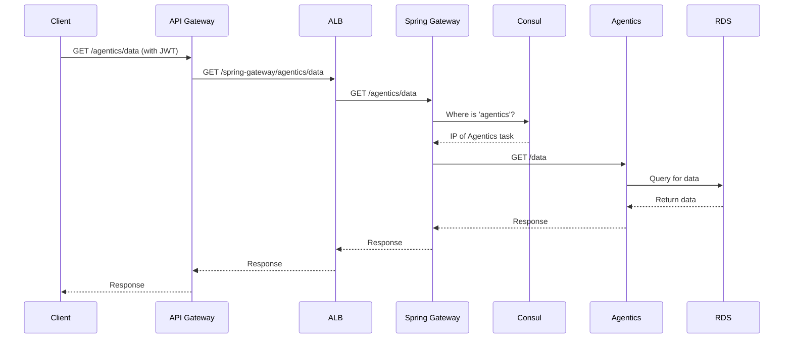

### Overall Architecture Review

Our architecture is a modern, microservices-based system designed for scalability, resilience, and security on AWS. It effectively separates concerns into distinct layers: a secure network foundation, a flexible application layer with containerized services, a managed data layer, and a robust edge layer for handling incoming requests.

Here is a breakdown of the components and how they interact:

#### 1. Network Layer: The Foundation

This layer, primarily defined in [`modules/network/main.tf`](modules/network/main.tf), provides the secure and isolated environment for all your resources.

*   **VPC (`aws_vpc`):** A private, isolated section of the AWS cloud. It acts as the boundary for your entire application.
*   **Subnets:**
    *   **Public Subnets (`aws_subnet.public`):** These subnets have a direct route to the internet via the **Internet Gateway (`aws_internet_gateway`)**. They are used for resources that need to be publicly accessible, such as the **Application Load Balancer (ALB)** and the **NAT Gateway**.
    *   **Private Subnets (`aws_subnet.private`):** These subnets do not have a direct route to the internet. Resources here (like your ECS tasks, EC2 Consul server, and RDS database) are protected from direct external access. They can initiate outbound connections to the internet (e.g., for software updates or sending traces to AWS X-Ray) through the **NAT Gateway (`aws_nat_gateway`)**.
*   **Security Groups:** These act as virtual firewalls, controlling inbound and outbound traffic for your resources. You have granular security groups for the ALB, ECS tasks, RDS, and the Consul EC2 instance, ensuring that they can only communicate with each other on specific ports and protocols.

#### 2. Application & Compute Layer: The Core Logic

This is where your application code runs.

*   **ECS Fargate Cluster (`aws_ecs_cluster`):** Defined in [`modules/ecs_fargate/main.tf`](modules/ecs_fargate/main.tf), this is a serverless compute engine for your containers. You don't need to manage the underlying EC2 instances. Your services are deployed as Fargate tasks:
    *   **`keycloak`:** Your identity and access management service.
    *   **`nextjs`:** Your frontend application.
    *   **`spring-gateway`:** The central routing point for your backend microservices.
    *   **`agentics`, `backoffice`, `quality-control`:** Your core backend microservices.
*   **EC2 Instance (`aws_instance`):** Defined in [`modules/compute/main.tf`](modules/compute/main.tf), this single EC2 instance runs in a private subnet and is dedicated to running **Consul**. Its purpose is service discovery; the `spring-gateway` queries it to find the current IP addresses of the backend microservices.
*   **ECR (`aws_ecr_repository`):** Defined in [`modules/ecr/main.tf`](modules/ecr/main.tf), this is your private Docker container registry. Your ECS tasks pull their respective Docker images from here upon deployment.

#### 3. Data & Observability Layer

*   **RDS PostgreSQL (`aws_db_instance`):** Defined in [`modules/rds/main.tf`](modules/rds/main.tf), this is your managed relational database. It runs in the private subnets, and only your ECS tasks (via their security group) can access it. Credentials are not hardcoded but are securely managed by **AWS Secrets Manager**.
*   **AWS X-Ray:** Integrated via the `xray-daemon` sidecar in your ECS tasks. It captures traces of requests as they travel through your system, from the API Gateway to your microservices and database, helping you debug performance issues.
*   **CloudWatch Logs:** All your services (ECS, RDS) are configured to send logs to CloudWatch for centralized monitoring and analysis.

#### 4. Communication and Request Flow

This is how all the pieces work together, as configured in [`live/my-project/main.tf`](live/my-project/main.tf).

1.  **Entry Point:** A user request first hits the **AWS API Gateway**.
2.  **Initial Routing (API Gateway):** The API Gateway inspects the request path.
    *   If the path is for a direct service (e.g., `/keycloak`, `/nextjs`), it proxies the request directly to the corresponding path on the **ALB**.
    *   If the path is for a microservice (e.g., `/agentics`), it proxies the request to the `spring-gateway` path on the ALB (e.g., `/spring-gateway/agentics`).
3.  **Load Balancing (ALB):** The ALB receives the request from the API Gateway.
    *   It terminates SSL/TLS, so backend services don't have to handle encryption.
    *   It inspects the path and forwards the request to the correct **Target Group**. For example, a request to `/keycloak/*` goes to the `keycloak` target group, and a request to `/spring-gateway/*` goes to the `spring-gateway` target group.
4.  **Internal Routing (Spring Gateway & Consul):**
    *   When the `spring-gateway` receives a request (e.g., for `/agentics`), it queries the **Consul** EC2 instance to discover the current private IP address of a healthy `agentics` task.
    *   It then forwards the request to that `agentics` task.
5.  **Backend Processing:** The final ECS task (e.g., `agentics` or `keycloak`) processes the request, potentially querying the **RDS PostgreSQL** database.
6.  **Response:** The response travels back through the same path to the user.

### User Request Scenarios

Here are a few examples of how requests are handled:

**Scenario 1: User logs in via the frontend**

The user interacts with the Next.js UI, which makes an authentication request.

**Scenario 2: User fetches data from a microservice**

The authenticated user, via the Next.js frontend, requests data that is served by the `agentics` microservice.

This architecture is robust and follows best practices for cloud-native applications. It provides a clear separation of concerns, strong security posture, and a scalable foundation for your microservices.